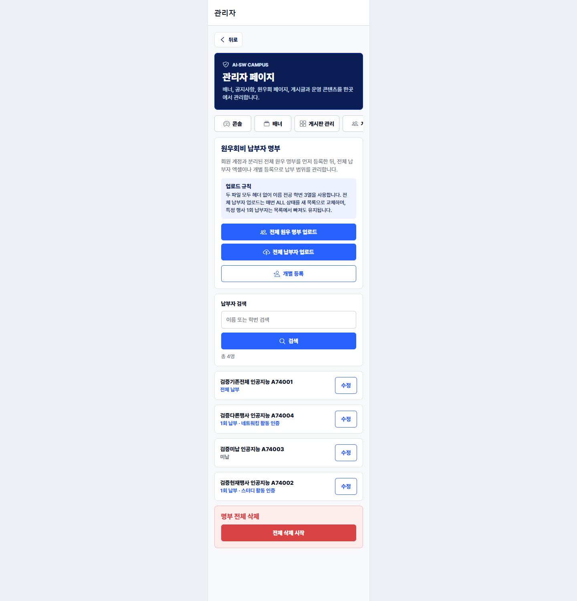
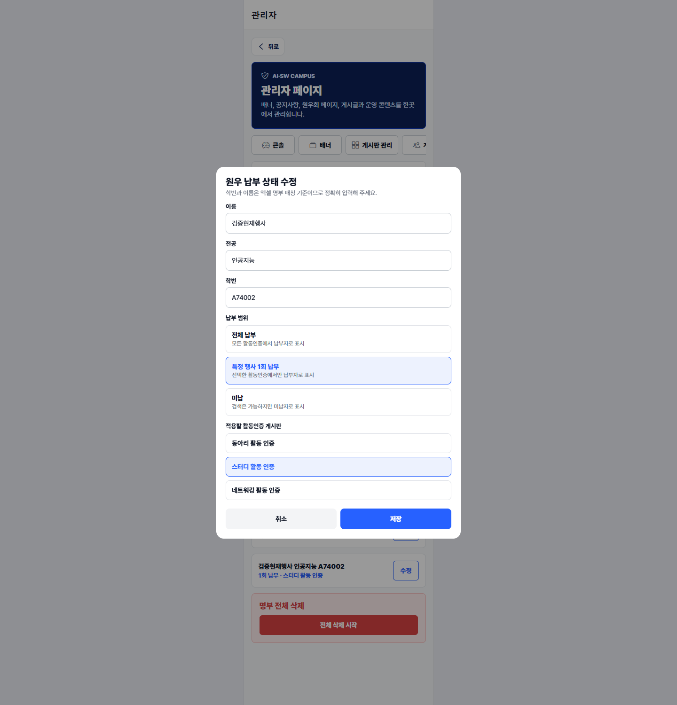
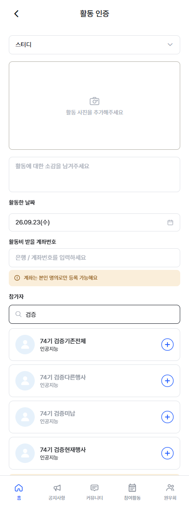

# 원우회비 납부 범위 검증

- 검증일: 2026-09-23
- 기능 브랜치: `codex/dues-payment-scope`
- 기능 기준 커밋: `e8bb240`
- 현재 활동인증 게시판: `스터디 활동 인증` (`board_id=12`)
- 비교 활동인증 게시판: `네트워킹 활동 인증` (`board_id=13`)

## 관리자 사용 순서

1. `관리자 > 원우회비`에서 헤더 없는 `이름 / 전공 / 학번` 3열 엑셀을 `전체 원우 명부 업로드`로 등록한다.
2. 같은 형식의 전체 납부자 엑셀을 `전체 납부자 업로드`로 등록한다. 이 업로드는 포함된 원우를 `ALL`로 전환하고, 이전 `ALL` 중 빠진 원우는 `UNPAID`로 초기화한다. 기존 `ONCE`는 유지한다.
3. 특정 행사만 납부한 원우는 목록의 `수정` 또는 `개별 등록`에서 `특정 행사 1회 납부`를 선택하고 적용할 활동인증 게시판을 지정한다.
4. 활동인증 작성 화면에서 참가자 이름을 검색한다. 전체 명부의 원우가 모두 검색되며, 현재 게시판 기준 납부자는 검정, 미납 또는 다른 게시판 전용 납부자는 회색으로 표시된다.

## 브라우저 검증 시나리오

| 원우 | 관리자 상태 | 스터디 활동 인증 | 네트워킹 활동 인증 |
| --- | --- | --- | --- |
| 검증기존전체 `A74001` | `ALL` | 납부 `true` / 검정 | 납부 `true` |
| 검증현재행사 `A74002` | `ONCE` · 스터디 활동 인증 | 납부 `true` / 검정 | 납부 `false` |
| 검증미납 `A74003` | `UNPAID` | 납부 `false` / 회색 | 납부 `false` |
| 검증다른행사 `A74004` | `ONCE` · 네트워킹 활동 인증 | 납부 `false` / 회색 | 납부 `true` |

브라우저에서 명부 업로드, 전체 납부자 업로드, 두 원우의 행사별 1회 납부 지정을 순서대로 실행했다. 스터디 활동인증 참가자 검색 결과의 계산된 색상은 납부자 `rgb(33, 36, 41)`, 현재 게시판 기준 미납자 `rgb(138, 145, 156)`로 확인했다. 브라우저 콘솔 오류는 없었다.

네 원우의 `participant_dues_payer_ids`를 모두 포함한 활동인증 게시물도 저장했다. 서버가 저장한 참가자 스냅샷은 `74기 검증기존전체, 74기 검증현재행사, 74기 검증미납, 74기 검증다른행사`였으며, 결제 상태와 무관하게 전체 명부 원우를 참가자로 선택할 수 있음을 확인했다.

## 캡처

### 관리자 일괄 업로드 및 최종 상태

### 특정 행사 1회 납부 지정

### 활동인증 참가자 검색 색상

## 자동 검증

- Backend: `python -m pytest -q` → `445 passed, 1 skipped`
- Backend contract: `python scripts/verify_backend.py` → 통과
- Alembic: `python -m alembic heads` → `0028_dues_payment_scope (head)` 단일 헤드
- Frontend: `npm test` → `674 passed`
- Frontend: `npm run typecheck` → 통과
- Frontend: `npm run lint` → 오류 0, 기존 경고 6

## 검증 환경

Docker Desktop은 호스트의 기존 `sailor-ingest.sock` 잠금 문제로 Compose 기동이 불가능했다. 기능 코드는 수정하지 않고, 동일 FastAPI 애플리케이션과 현재 SQLAlchemy 모델을 격리 SQLite 데이터베이스의 `test` 환경으로 기동하고 Expo Web을 연결해 브라우저 검증했다. Alembic 마이그레이션 자체는 별도의 단일 헤드 검사와 백엔드 마이그레이션 테스트로 검증했다.
