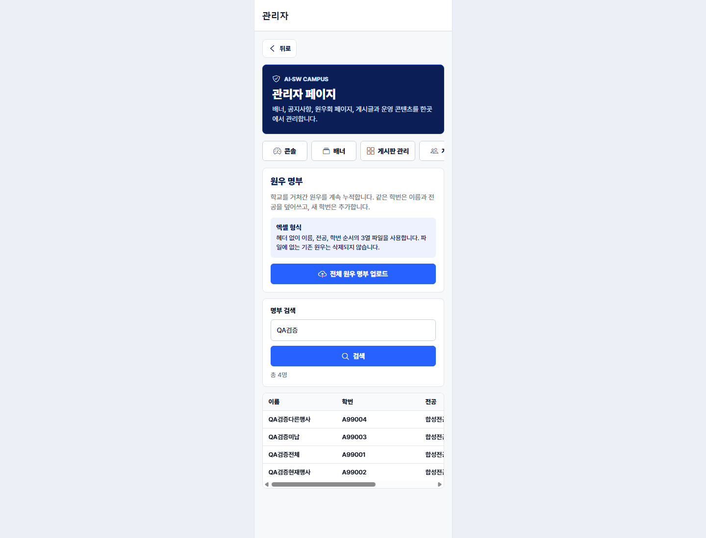
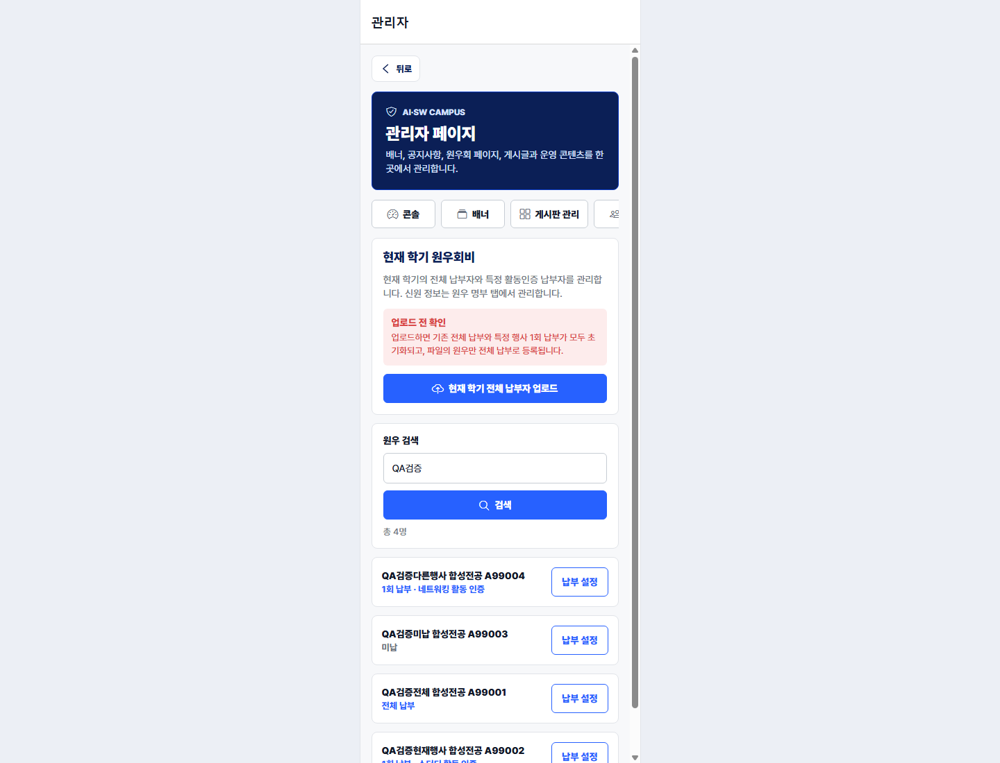
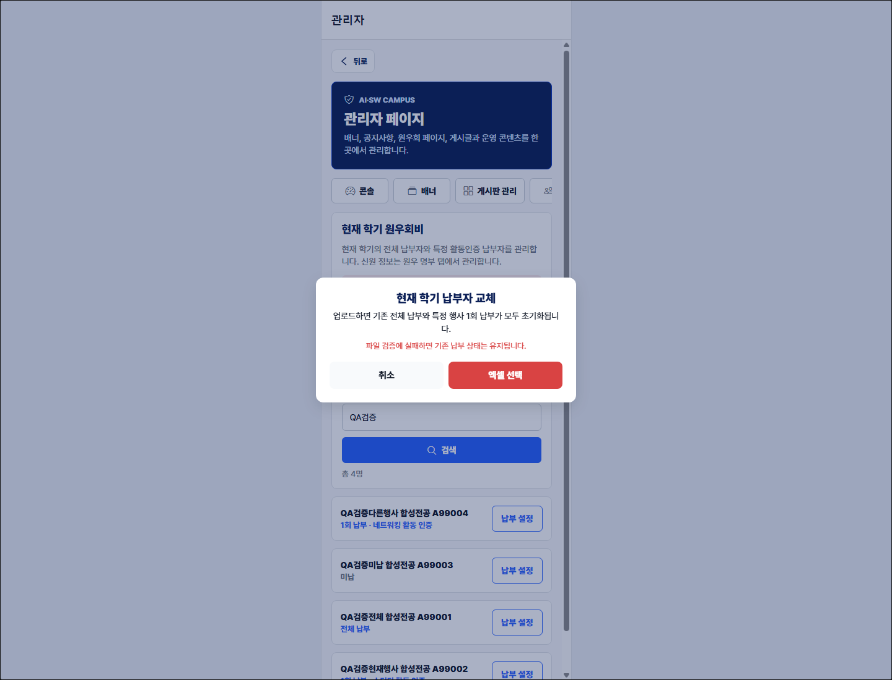
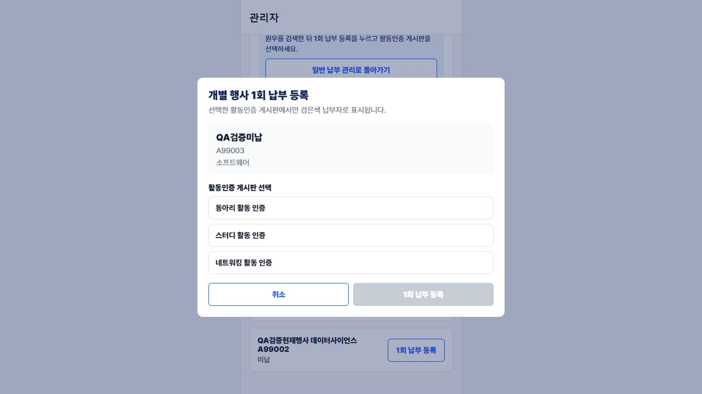
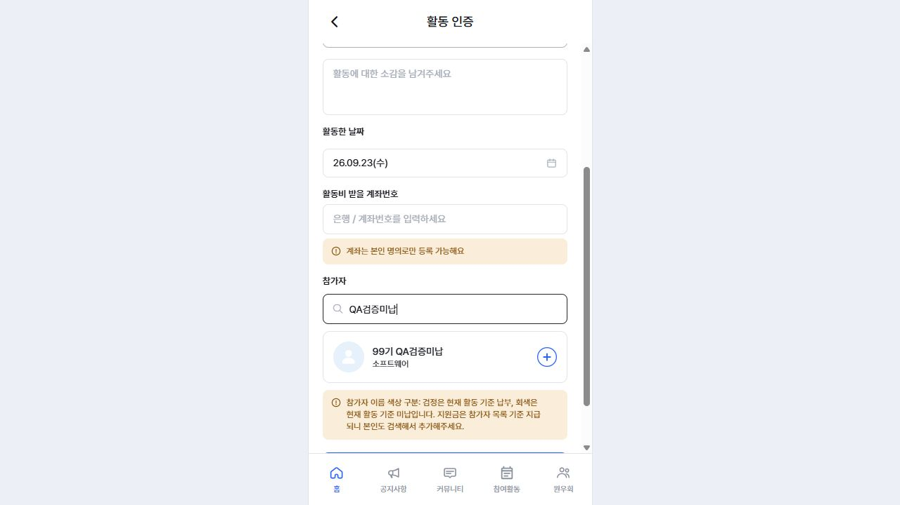
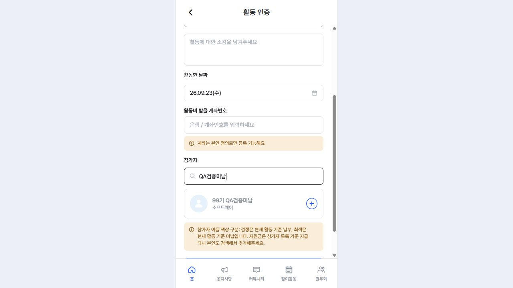
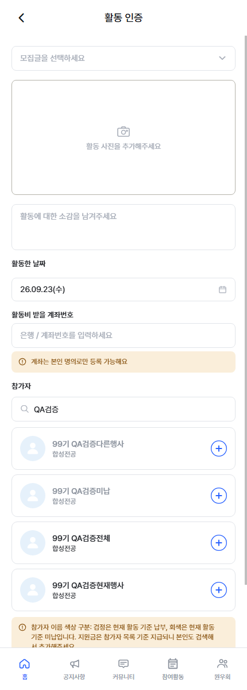

# 원우 명부 · 원우회비 분리 검증

검증일: 2026-09-23 (KST)

브랜치: `codex/dues-payment-scope`

Alembic head: `0029_roster_dues_separation`

## 확정 동작

| 영역 | 확정 규칙 | 검증 결과 |
| --- | --- | --- |
| 원우 명부 | 학교를 거쳐간 사람을 누적한다. 업로드 시 학번 기준 신규 추가, 기존 이름/전공 덮어쓰기, 누락 원우 유지 | API/서비스/화면 검증 통과 |
| 현재 학기 납부 | 업로드 파일 전체를 먼저 검증한 뒤 기존 `ALL`과 `ONCE`를 모두 지우고 업로드 원우를 `ALL`로 등록 | 원자성·교체 테스트 통과 |
| 개별 납부 설정 | 신원은 읽기 전용이고 `ALL`, 활동인증 보드 하나의 `ONCE`, `UNPAID`만 변경 | API/UI 테스트 통과 |
| 개별 행사 바로 등록 | 원우회비 탭에서 전용 등록 모드를 열고 원우 검색 → 활동인증 게시판 선택 → `ONCE` 저장 | 실제 관리자 화면 저장 검증 통과 |
| 활동인증 검색 | 모든 명부 원우를 검색·선택 가능. `ALL`/현재 보드 `ONCE`는 검정, 미납/다른 보드 `ONCE`는 회색 | 실제 렌더링 및 색상 값 검증 통과 |

## 화면 검증 데이터

스터디 활동인증 보드 ID `12`, 다른 네트워킹 활동인증 보드 ID `13`을 사용했다.

| 원우 | 현재 학기 상태 | 보드 12 활동인증 예상 | 실제 렌더링 |
| --- | --- | --- | --- |
| QA검증전체 (`A99001`) | `ALL` | 검정 | `rgb(33, 36, 41)` |
| QA검증현재행사 (`A99002`) | `ONCE`, 보드 12 | 검정 | `rgb(33, 36, 41)` |
| QA검증미납 (`A99003`) | `UNPAID` | 회색 | `rgb(138, 145, 156)` |
| QA검증다른행사 (`A99004`) | `ONCE`, 보드 13 | 회색 | `rgb(138, 145, 156)` |

관리자 명부 검색은 네 원우의 이름·학번·전공과 `총 4명`을 확인했다. 원우회비 화면은 전체 납부, 두 개의 보드별 1회 납부, 미납을 함께 표시했다. 교차 플랫폼 확인 모달에서 업로드가 기존 전체/1회 납부를 모두 초기화한다는 경고를 확인했고, `엑셀 선택`을 누르면 Chrome DevTools Protocol의 `Page.fileChooserOpened` 이벤트가 실제 발생하는 것도 검증했다.

추가로 `개별 행사 1회 납부 등록` 전용 동선에서 `QA검증미납`을 네트워킹 활동인증으로 저장했다. 관리자 목록은 `1회 납부 · 네트워킹 활동 인증`으로 갱신됐고, 참가자 검색 이름 색상은 네트워킹 보드에서 `rgb(33, 36, 41)`, 스터디 보드에서 `rgb(138, 145, 156)`으로 확인했다.

## 증빙 화면

### 원우 명부

### 현재 학기 원우회비

### 납부자 전체 교체 확인

### 개별 행사 1회 납부 등록

### 개별 행사 적용 색상

### 활동인증 참가자 색상

## 자동 검증

| 명령 | 결과 |
| --- | --- |
| `cd backend && python -m pytest -q` | `447 passed, 1 skipped, 1 warning` |
| `cd frontend && npm test` | `678 passed, 0 failed` |
| `cd frontend && npm run typecheck` | 종료 코드 0 |
| `cd frontend && npm run lint` | 종료 코드 0, 기존 경고 6개, 오류 0개 |
| `cd backend && python -m compileall -q app alembic` | 종료 코드 0 |
| `cd backend && python -c "from app.main import app; ..."` | import 성공, route 22개 |
| `cd backend && python -m alembic heads` | `0029_roster_dues_separation (head)` |
| Chrome CDP 관리자 업로드 상호작용 | 확인 모달 렌더링, `엑셀 선택`, `Page.fileChooserOpened: true` |

핵심 회귀 테스트는 명부 신원 overwrite가 납부 상태를 건드리지 않는지, 납부 업로드가 기존 `ALL`/`ONCE` 전부를 교체하는지, 검증 실패 시 기존 납부 스냅샷이 유지되는지, 개별 변경이 신원을 수정하지 않는지, 활동인증이 미납 원우도 허용하는지를 포함한다.

## PostgreSQL 마이그레이션 환경 제한

`python -m alembic current`는 기본 개발 URL의 Docker Compose 호스트 `db`를 Windows 호스트에서 해석할 수 없어 `failed to resolve host 'db'`로 종료됐다. `docker version`도 `dockerDesktopLinuxEngine` named pipe가 없어 Docker Desktop daemon이 실행 중이지 않음을 확인했다. 따라서 이번 확인에서는 다음 근거를 사용했다.

- `python -m alembic heads`: 단일 head `0029_roster_dues_separation`
- 전체 백엔드 테스트와 `test_dues_payer_migration.py`의 SQLite upgrade/downgrade·ID/범위 보존·보드 삭제 회귀
- SQLAlchemy 모델 import/compile 검증

Docker Desktop이 가능한 환경에서 `0028 → 0029 → 0028 → 0029` PostgreSQL 리허설을 추가로 수행해야 한다. 이 환경 제한은 기능 테스트 실패가 아니라 외부 런타임 미가동으로 분류한다.
